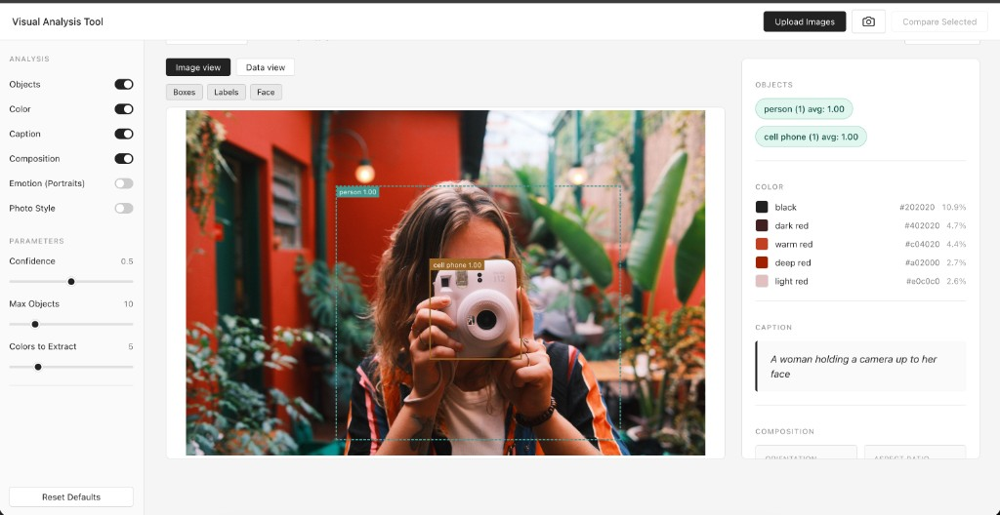
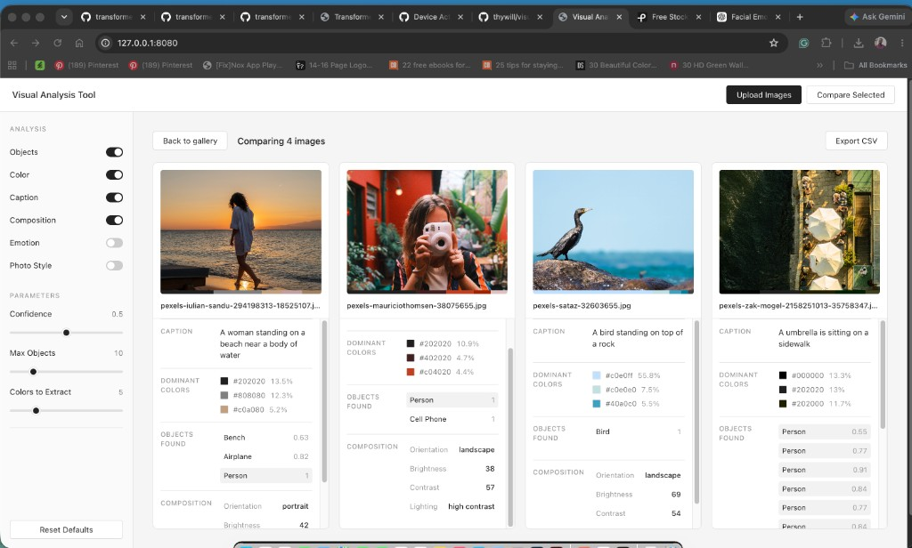
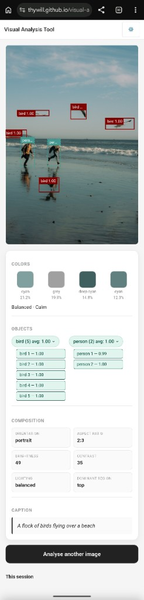

# Visual Analysis Tool

A browser-based visual analysis tool built with HTML, CSS, and JavaScript. The project is based on a collection and exploration of browser-ready AI models from Hugging Face Transformers.js, using them to test how object detection, image captioning, emotion detection, and scene classification can support visual research and comparison.

## Overview

Visual Analysis Tool helps designers, students, and researchers quickly inspect image content without sending image files to a server. The app analyzes uploaded images for objects, dominant colors, captions, composition, and optional portrait emotion or photo style information.

The project uses browser-based JavaScript and client-side machine learning models from Hugging Face Transformers.js. Model files are loaded in the browser when needed, and image analysis results are displayed through gallery cards, detailed image views, comparison tables, and visual scatter plots.

## Features

- Upload one or more JPG, PNG, or WEBP images.
- Capture an image from the device camera when supported.
- Detect objects and draw bounding boxes over images.
- Extract dominant colors with names, hex values, and percentages.
- Generate an image caption.
- Analyze composition details such as orientation, aspect ratio, brightness, contrast, lighting type, dominant region, and negative space.
- Optionally analyze emotion for portrait images and photo style for scene/background context.
- Open a detailed view for a single image with image and data tabs.
- Select multiple images and compare them in a table or visual brightness/contrast space.
- Export a single-image text report or a multi-image CSV file.
- Use a responsive mobile layout for camera/upload-based analysis.

## Screenshots

### Desktop Detail View



### Desktop Compare View



### Mobile View



## Presentation

The project presentation PDF is included in this repository:

[Visual Analysis Tool Presentation](docs/visual-analysis-tool-presentation.pdf)

## Getting Started

### Prerequisites

- Node.js and npm
- A modern browser such as Chrome, Edge, Firefox, or Safari
- Internet access on first use so the browser can load external model files

### Installation

Clone the repository:

```bash
git clone https://github.com/thywill/visual-analysis-tool.git
cd visual-analysis-tool
```

Install dependencies:

```bash
npm install
```

Run the project with a local development server:

```bash
npx live-server
```

You can also open `index.html` with a local server extension such as VS Code Live Server.

## Usage

1. Open the app in a browser.
2. Upload images by clicking `Upload Images` or dragging files into the upload area.
3. Use the sidebar to choose which analyses to run: objects, color, caption, composition, emotion, and photo style.
4. Adjust parameters such as confidence threshold, maximum objects, and number of colors to extract.
5. Click an image card to open the detailed analysis view.
6. Select two or more images and click `Compare Selected` to compare results.
7. Export results as a text report from the detailed view or as a CSV from the comparison view.

On mobile, the app provides camera and upload buttons, a compact results view, and a session history for recently analyzed images.

## File Structure

```text
visual-analysis-tool/
├── index.html              Main HTML entry point
├── package.json            Project metadata and npm scripts
├── docs/                   Project presentation and documentation files
├── screenshots/            README screenshots
├── style/
│   └── main.css            App layout, desktop, and mobile styles
└── js/
    ├── main.js             App startup, uploads, camera capture, and layout mode
    ├── models.js           Browser model loading and status tracking
    ├── analysis/           Image analysis modules
    ├── ui/                 Gallery, detailed view, comparison, mobile, and sidebar UI
    └── utils/              Export and overlay helpers
```

## Technology

- HTML, CSS, and vanilla JavaScript
- ES modules
- Hugging Face Transformers.js for browser-based AI models
- Canvas APIs for color and composition analysis

## GenAI Statement

Generative AI tools were used as coding assistance during development for brainstorming, debugging, code improvement, and documentation support. The work followed a vibe coding framework: features were developed through an iterative cycle of describing the intended interaction, generating or revising code with AI assistance, testing the result in the browser, and refining the implementation based on observed behavior.

Prompt engineering was used to guide the AI tools toward the project goals, including browser-based privacy, use of Transformers.js models, responsive desktop/mobile layouts, clear visual analysis outputs, and readable code organization. The final implementation, project decisions, and submitted code were reviewed and edited by the author.

## Credits

Author: Thywill Olude, The Ohio State University

Course: DESIGN 5193

Instructor: Gaëtan Robillard, The Ohio State University

## License

MIT
